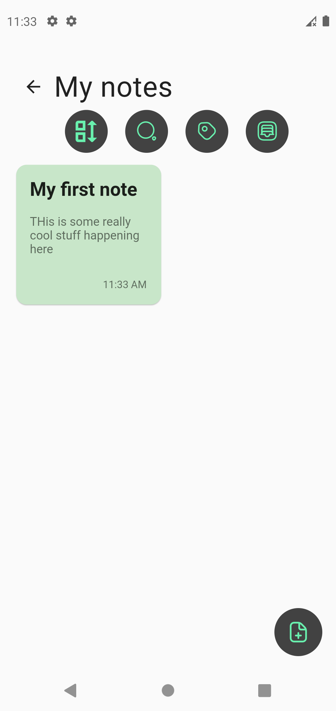
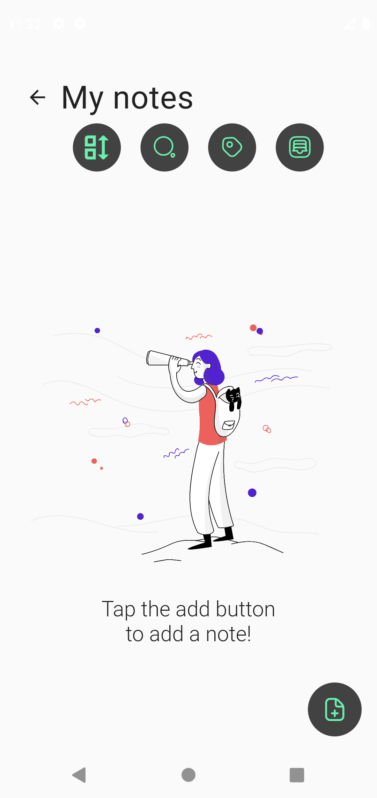
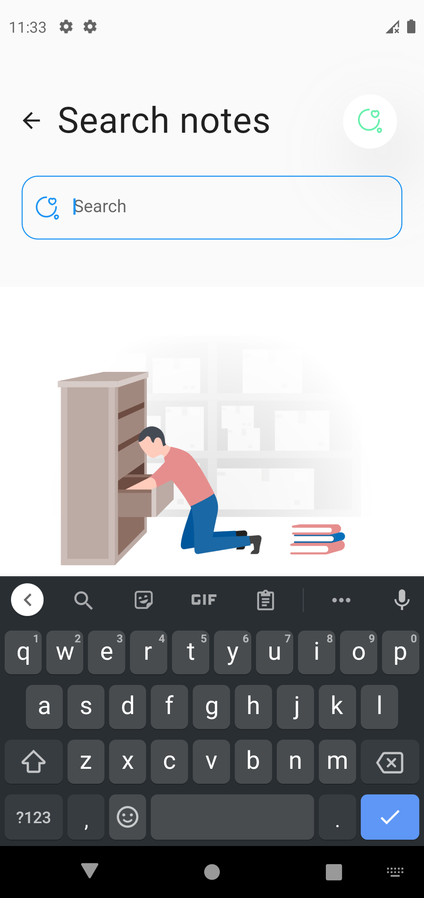
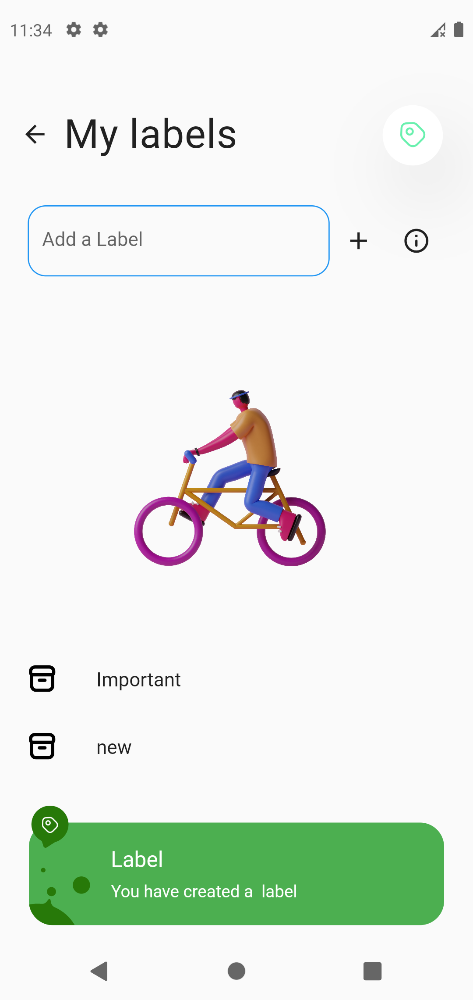

#  Flutter Noter App 
Simple notes project

### Made ❤ with flutter.

  Please star⭐ the repo if you like what you see😉.

#### 💻 Requirements

#### SetUp Repo

Get your flutter environment up and running.

- [Get Started: Install and setUp flutter and dart SDK's](https://flutter.dev/)
- [Cookbook: Useful Flutter samples to get started](https://flutter.dev/docs/cookbook)
- [Flutter documentation](https://flutter.dev/docs), which offers tutorials,
  samples, guidance on mobile development, and a full API reference.

- [Clone Repo "http"](https://github.com/Anslem27/Get-Hydrated.git)
- Fetch Packages: `flutter pub get`
- Run App: `flutter run`

#### Additional Requirements.

- [Preferably use VsCode](https://code.visualstudio.com/)
- [Better comments -> Elaborated Comments](https://marketplace.visualstudio.com/items?itemName=aaron-bond.better-comments)

- Any Operating System (ie. MacOS X, Linux, Windows) running Flutter 2.10.xx and above
- Any IDE with Flutter SDK installed (ie.Android Studio, VSCode etc)
- A little knowledge of Dart and Flutter

## ✨ Features

- [x] Create and fully customize note plus color
- [x] Easily archive note
- [x] Search through notes
- [x] E.t.c

## Whats not working

- [x] Afew bugs 

## 📸 ScreenShots

| Light                                  |
| ---------------------------------      |
|   |
|   |
|   |
|   |

## 🤓 Author

**Anslem Seguya**
[Twitter](https://twitter.com/anslemAnsy?t=_R65Xz8wfSvZ5Nyeqh3p5A&s=09)

## 🔖 LICENCE
#### Sofar non needed 
